<div align="center">

# Waydir

Fast, keyboard-first desktop file manager with dual panes, tabs, network drives, Quick Look, plugins and a native Rust core.

[](https://flutter.dev)
[](https://dart.dev)
[]()
[](LICENSE)

<p>
  <a href="https://github.com/Waydir/Waydir/releases"><b>Download</b></a>
  -
  <a href="#install"><b>Install</b></a>
  -
  <a href="docs/plugins.md"><b>Plugins</b></a>
  -
  <a href="CHANGELOG.md"><b>Changelog</b></a>
</p>

</div>

<p align="center">
  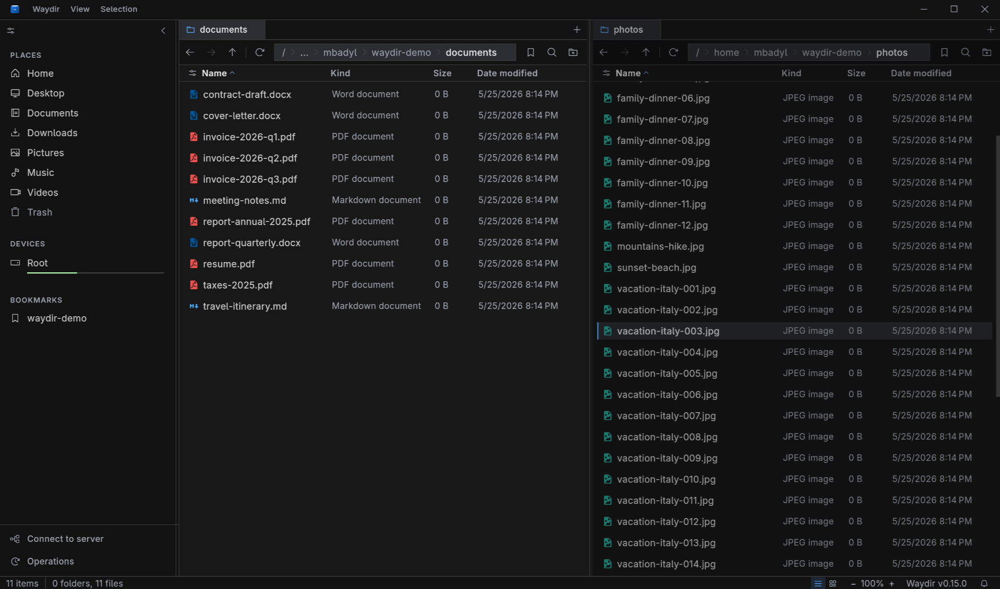
</p>

## Why Waydir?

Waydir is a native-feeling desktop file manager focused on speed, direct control and everyday file work.

| What you get | Why it matters |
|--------------|----------------|
| Dual panes and tabs | Move between folders without juggling windows. |
| Keyboard-first workflow | Navigate, select, preview, copy, move, rename and search without reaching for the mouse. |
| Command palette | Press `Ctrl+P` to fuzzy-search actions, bookmarks, drives, recent locations, files and plugin commands. |
| Native Rust core | Large directories, recursive search and trash operations stay off the UI thread. |
| SMB and SFTP drives | Remote files show up beside local files and behave like part of the same workspace. |
| Quick Look previews | Tap Space to preview images, PDFs, text, code and file properties. |
| Lua plugins | Add workflow actions, toolbar buttons, status bars and shortcuts without rebuilding the app. |

## See It Fast

<table>
  <tr>
    <td width="50%" align="center">
      <b>Keyboard-driven navigation</b><br>
      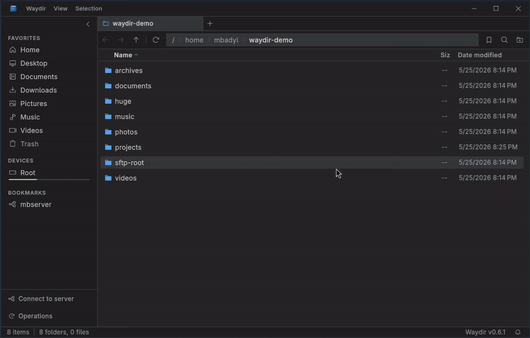
    </td>
    <td width="50%" align="center">
      <b>Dual-pane copy</b><br>
      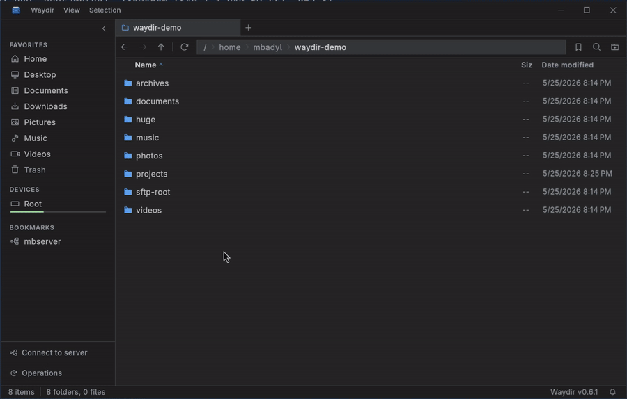
    </td>
  </tr>
  <tr>
    <td width="50%" align="center">
      <b>Quick Look preview</b><br>
      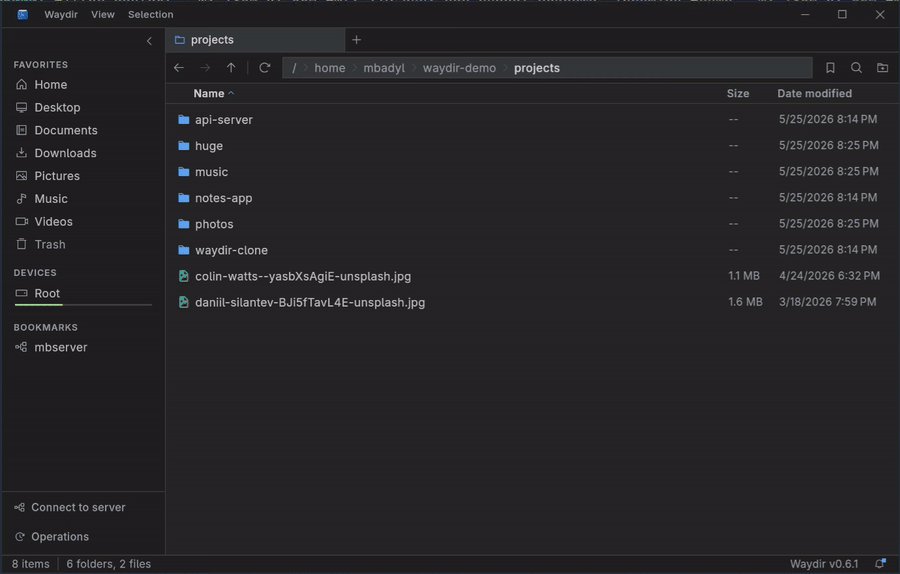
    </td>
    <td width="50%" align="center">
      <b>Live recursive search</b><br>
      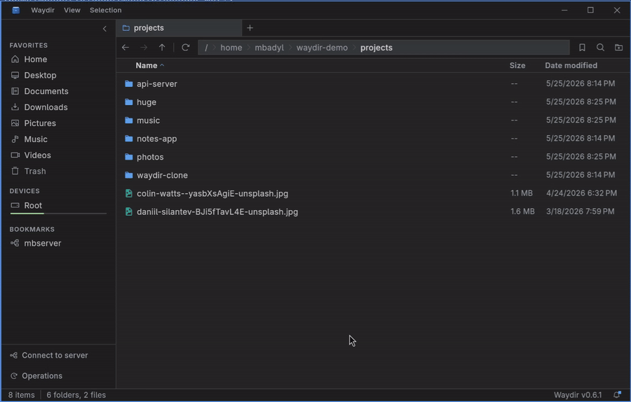
    </td>
  </tr>
</table>

## Install

Grab the latest build from [Releases](https://github.com/Waydir/Waydir/releases), or install from the Linux package repository for automatic updates through your package manager.

| Platform | Recommended install |
|----------|---------------------|
| Ubuntu / Debian | apt repository or `.deb` package |
| Fedora / RHEL | dnf repository or `.rpm` package |
| openSUSE | zypper repository or `.rpm` package |
| Other Linux | AppImage or portable tarball |
| Windows | `.exe` installer or portable `.zip` |
| macOS | `.dmg` package |

### Ubuntu / Debian

Repository install, with updates via `apt upgrade`:

```bash
curl -1sLf 'https://dl.cloudsmith.io/public/waydir/waydir-project/setup.deb.sh' | sudo -E bash
sudo apt install waydir
```

Single `.deb` package from [Releases](https://github.com/Waydir/Waydir/releases):

```bash
sudo dpkg -i waydir-*.deb
```

### Fedora / RHEL

Repository install, with updates via `dnf upgrade`:

```bash
curl -1sLf 'https://dl.cloudsmith.io/public/waydir/waydir-project/setup.rpm.sh' | sudo -E bash
sudo dnf install waydir
```

Single `.rpm` package from [Releases](https://github.com/Waydir/Waydir/releases):

```bash
sudo rpm -i waydir-*.rpm
```

### openSUSE

Repository install, with updates via `zypper update`:

```bash
curl -1sLf 'https://dl.cloudsmith.io/public/waydir/waydir-project/setup.rpm.sh' | sudo -E bash
sudo zypper install waydir
```

Single `.rpm` package from [Releases](https://github.com/Waydir/Waydir/releases):

```bash
sudo rpm -i waydir-*.rpm
```

### Other Linux

AppImage:

```bash
chmod +x waydir-*.AppImage
./waydir-*.AppImage
```

Portable tarball:

```bash
tar -xzf waydir-*-linux-x64.tar.gz
./waydir
```

Package builds integrate with your desktop launcher. AppImage and tarball builds are portable and can be launched from any folder.

Package repository hosting is provided by [Cloudsmith](https://cloudsmith.com), a hosted universal package management platform.

### Windows

Download the `.exe` installer or portable `.zip` from [Releases](https://github.com/Waydir/Waydir/releases). Run the installer, or unpack the archive and launch `waydir.exe`.

### macOS

Download the `.dmg` package from [Releases](https://github.com/Waydir/Waydir/releases), open it and drag Waydir to Applications.

macOS is officially supported and maintained by [@fwitkowski17](https://github.com/fwitkowski17).

## Features

### Browse and navigate

- Two folders side by side, each with its own draggable tabs.
- Command palette for fuzzy-searching actions, bookmarks, drives, recent locations, files and plugin commands.
- Sidebar with your places, drives, bookmarks and network locations.
- Quick path bar for jumping to any folder.
- List and grid views with image thumbnails and columns you choose.

### Work with files

- Copy, move, rename, trash and delete with progress you can cancel.
- Handles name clashes when copying, and renames many files at once.
- Open ZIP and TAR archives and browse inside without extracting.

### Find and preview

- Fast search that fills in results as it scans, with pattern matching.
- Filter the current folder by type, size, date, name or hidden files.
- Quick Look on `Space` for images, PDFs, text, code and file details.
- Edit text right in the preview, with line numbers and optional Vim mode.

### Reach further

- Connect to SMB and SFTP and work with remote files like local ones.
- Browse files and open a terminal inside WSL distributions (Windows).
- Built-in terminal for each pane that opens in the current folder.
- Git status with branch switching and stash management.

### Make it yours

- Light, Dark, Nord and One Dark themes, plus your own themes.
- Adjust density, sorting, hidden files and date format to taste.
- Launch from the command line with a folder to open.

## Plugins

Plugins let you add small workflow actions without rebuilding Waydir. They are plain Lua folders with a `manifest.json` and an `init.lua`.

Drop a plugin into the plugins folder, reload from Preferences -> Plugins and it can add:

- Selection context menu actions.
- Background context menu actions.
- Top Plugins menu entries.
- Location toolbar buttons.
- Keyboard shortcuts.
- Global and per-pane status bars.
- Long-running tasks in the Operations panel.

Plugins run in a sandbox and request explicit permissions for external commands or file operations.

Start here:

- [Plugin guide](docs/plugins.md)
- [Example plugins](docs/examples/plugins/)

Example plugin ideas already covered in the repository include opening the current folder in VS Code, adding 7-Zip actions, showing selection counts and running backup copies.

## Architecture

Waydir uses three layers so heavy work does not block the UI:

| Layer | Responsibility |
|-------|----------------|
| Flutter UI | Rendering, input and desktop chrome. |
| Dart isolates | Long-running copy, move, delete and network transfers. |
| Rust core | Directory listing, recursive search, trash and PTY work through FFI. |

Persistent state uses `drift` and `sqlite3`. Reactive UI state uses `signals`. The UI thread does no filesystem-heavy work.

The native Rust library is required. There is no Dart fallback for the Rust core.

## Feature Gallery

<table>
  <tr>
    <td width="50%" align="center">
      <b>Browse remote files over SFTP</b><br>
      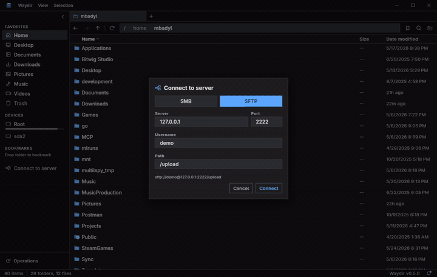
    </td>
    <td width="50%" align="center">
      <b>Archive browsing</b><br>
      
    </td>
  </tr>
  <tr>
    <td width="50%" align="center">
      <b>Built-in terminal per pane</b><br>
      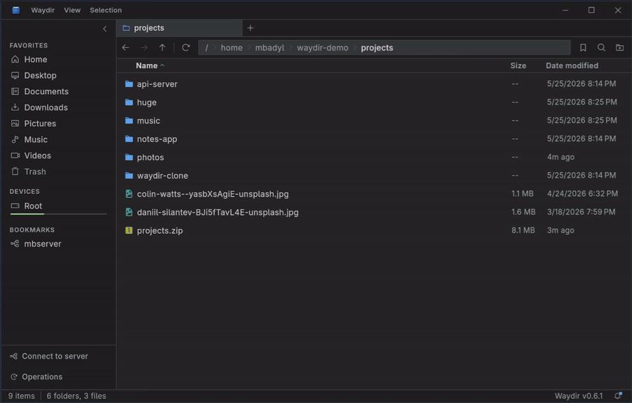
    </td>
    <td width="50%" align="center">
      <b>Tabs per pane</b><br>
      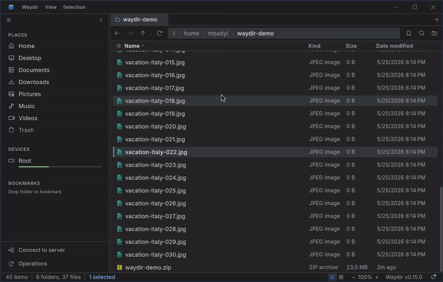
    </td>
  </tr>
  <tr>
    <td width="50%" align="center">
      <b>Filter search</b><br>
      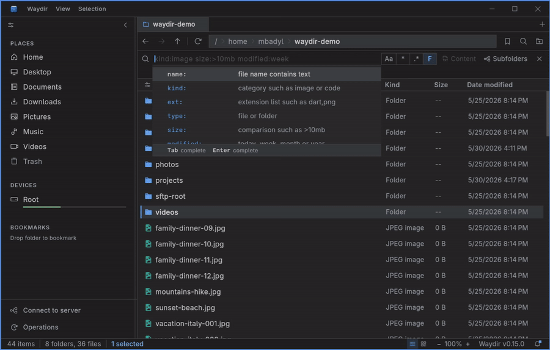
    </td>
    <td width="50%" align="center">
      <b>Customization</b><br>
      
    </td>
  </tr>
  <tr>
    <td width="50%" align="center">
      <b>Selection workflow</b><br>
      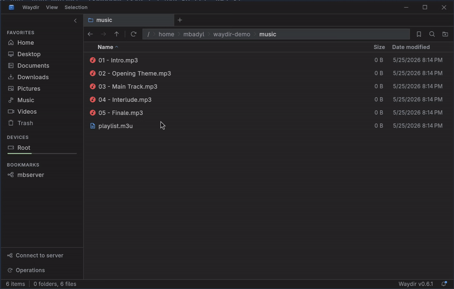
    </td>
    <td width="50%" align="center">
      <b>Multi-rename</b><br>
      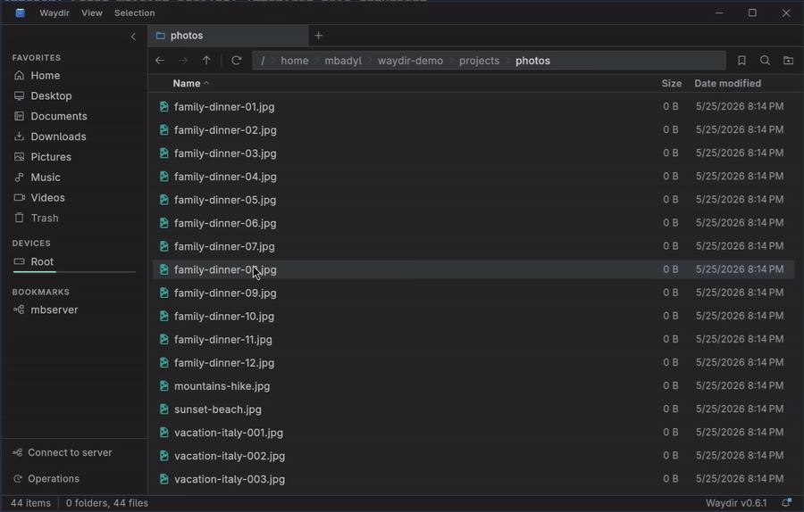
    </td>
  </tr>
</table>

## Build From Source

Requirements:

- Flutter 3.35+
- Dart 3.10+
- Rust stable from [rustup](https://rustup.rs)

Run from the repository root:

```bash
git clone https://github.com/Waydir/Waydir.git
cd Waydir
flutter pub get
cargo build --release --manifest-path rust/waydir_core/Cargo.toml
flutter run -d linux
```

The Rust build must be `--release`. Rebuild and restart the app after editing `rust/waydir_core`, because Flutter hot reload does not reload the native library.

For packaged native libraries:

```bash
scripts/build_waydir_core.sh
```

On Windows:

```powershell
scripts/build_waydir_core_windows.ps1
```

Build the Flutter app:

```bash
flutter build linux
```

Use `windows` or `macos` instead of `linux` for other desktop targets.

## Development

Before opening a pull request, run:

```bash
dart format .
flutter analyze
flutter test
```

Useful faster test commands:

```bash
flutter test --exclude-tags=integration
flutter test --tags=integration
```

Regenerate generated files when needed:

```bash
dart run slang
dart run build_runner build --delete-conflicting-outputs
```

## Project Status

Linux and Windows are the main development and testing targets. macOS is officially supported and maintained by [@fwitkowski17](https://github.com/fwitkowski17).

Bug reports, crash reports and focused pull requests are welcome. For non-trivial changes, open an issue first so the approach can be discussed before implementation.

## License

[MIT](LICENSE)
